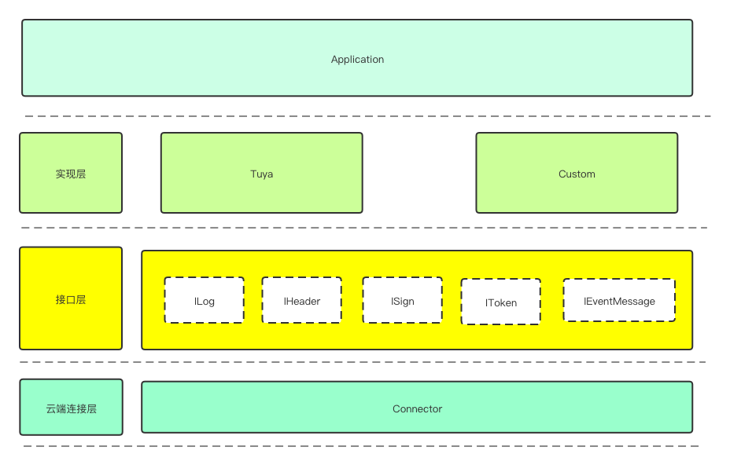

[English](README.md) | [中文版](README_cn.md)

[](https://github.com/tuya/tuya-connector-go/blob/master/LICENSE 'License')


`tuya-connector-go`通过简单的配置和灵活的扩展机制，将云端API映射成本地API，订阅云端消息分发为本地事件，使得开发者在云云对接（OpenAPI或者消息订阅）项目开发过程中，不需要花费过多精力关注云环境连接和请求处理过程，从而帮助开发者更好的聚焦在自身的业务逻辑上。

## 快速开始

#### 准备


- AccessId & AccessKey：平台授权密钥
- API地址：根据不同的业务区域选择API地址
- Pulsar地址：根据不同的业务区域选择Pulsar地址


#### 配置


- 第一种方式：设置环境变量，项目启动时从环境变量读取配置，推荐<br/>
export TUYA_API_HOST=https://xxxxx.com<br/>
export TUYA_ACCESSID=xxxxxx<br/>
export TUYA_ACCESSKEY=xxxxxxx<br/>
export TUYA_MSG_HOST=pulsar+ssl://xxxxxx

- 第二种方式：在项目里边定义变量，硬编码设置


#### 使用

##### 1、初始化应用（默认配置）

```go
func main() {
   // 默认配置
   connector.InitWithOptions()
   // 启动消息订阅服务
   go messaging.Listener()
   // 启动API服务
   r := router.NewGinEngin()
   go r.Run("0.0.0.0:2021")
   watitSignal()
}

func watitSignal() {
   quitCh := make(chan os.Signal, 1)
   signal.Notify(quitCh, syscall.SIGINT, syscall.SIGQUIT, syscall.SIGTERM)
   for {
      select {
      case c := <-quitCh:
         message.Handler.Stop()
         logger.Log.Infof("receive sig:%v, shutdown the http server...", c.String())
         return
      }
   }
}
```

或者，初始化应用时使用自定义配置：

```go
func main() {
   // 自定义配置
   connector.InitWithOptions(env.WithApiHost("xxxx"),
      env.WithMsgHost("xxxx"),
      env.WithAccessID("xxxx"),
      env.WithAccessKey("xxxx"))
   // 启动服务
   go messaging.Listener()
   r := router.NewGinEngin()
   go r.Run("0.0.0.0:2021")
   watitSignal()
}
```

##### 2、调用OpenAPI（这里使用gin框架作演示）

```go
// 使用gin创建路由
func initRouter(r *gin.Engine) {
   r.GET("/devices/:device_id", GetDevice)
}

func GetDevice(c *gin.Context) {
   device_id := c.Param("device_id")
   resp := &GetDeviceResponse{}
   // 发起API请求
   err := connector.MakeGetRequest(
      context.Background(),
      connector.WithAPIUri(fmt.Sprintf("/v1.0/devices/%s", device_id)),
      connector.WithResp(resp))
   if err != nil {
      fmt.Println("err:", err.Error())
      c.Abort()
      return
   }
   c.JSON(200, resp)
}

// OpenAPI返回的数据结构
type GetDeviceResponse struct {
   Code    int         `json:"code"`
   Msg     string      `json:"msg"`
   Success bool        `json:"success"`
   Result  interface{} `json:"result"`
   T       int64       `json:"t"`
}

```

在调用OpenAPI时可根据不同error错误码自定义处理逻辑，需要创建实现IError接口的struct

```go
type DeviceError struct {
}

func (d *DeviceError) Process(ctx context.Context, code int, msg string) {
   logger.Log.Error(code, msg)
}
```

```go
func GetDevice(c *gin.Context) {
   device_id := c.Param("device_id")
   resp := new(map[string]interface{})
   err := connector.MakeGetRequest(
      context.Background(),
      connector.WithAPIUri(fmt.Sprintf("/v1.0/devices/%s", device_id)),
      connector.WithResp(resp),
      // 设置错误码自定义事件处理
      connector.WithErrProc(1102, &DeviceError{}))
   if err != nil {
      fmt.Println("err:", err.Error())
      c.Abort()
      return
   }
   c.JSON(200, resp)
}
```

##### 3、订阅消息事件

```go
func Listener() {
   // 初始化消息队列客户端 
   message.Handler.InitMessageClient()
   // 订阅设备修改名称消息事件
   message.Handler.SubEventMessage(func(m *event.NameUpdateMessage) {
      logger.Log.Info("=========== name update： ==========")
      logger.Log.Info(m)
   })
   // 订阅设备数据上报消息事件
   message.Handler.SubEventMessage(func(m *event.StatusReportMessage) {
      logger.Log.Info("=========== report data： ==========")
      for _, v := range m.Status {
         logger.Log.Infof(v.Code, v.Value)
      }
   })
}
```

## 自定义扩展实现

- IError接口

   当请求OpenAPI后的响应结果返回错误码时，可以通过自定义实现`IError`的struct来针对不同的错误码进行相应的处理。<br/>


- ILog接口

   框架提供支持自定义实现ILog的日志struct来个性化打印，服务初始化时将对象注入到底层框架。<br />

   > ```
   > connector.InitWithOptions(env.WithLogWrapper(CustomLog))
   > ```

- IToken接口

   支持自定义实现IToken的token struct，管理token生命周期，获取或刷新token，token信息本地缓存，服务初始化时将对象注入到底层框架。<br />

   > ```
   > connector.InitWithOptions(env.WithTokenWrapper(CustomToken))
   > ```


- IHeader接口

   支持自定义header struct，请求涂鸦云OpenAPI时可自定义处理逻辑，包括需要添加的属性值以及签名，服务初始化时将对象注入到底层框架。<br />

   > ```
   > connector.InitWithOptions(env.WithHeaderWrapper(CustomHeader))
   > ```

- ISign接口

   实现ISign接口可自定义签名逻辑，服务初始化时将对象注入到底层框架。<br />

   > ```
   > connector.InitWithOptions(env.WithSignWrapper(CustomSign))
   > ```

- IEventMessage接口

   支持自定义消息事件订阅，不同消息队列连接方式、接收消息、数据解密可能会有所不同，此时需要自定义实现消息订阅逻辑。服务初始化时将对象注入到底层框架。<br />

   > ```
   > connector.InitWithOptions(env.WithEventMsgWrapper(CustomEventMessage))
   > ```

### 消息订阅

开发者针对需要订阅的事件添加相应的处理函数即可，框架内置了涂鸦所有云端消息事件类型，订阅的消息数据包括原始加密消息数据以及解密后的结构化的消息数据。

| **消息事件**                    | **BizCode**              | **描述**           |
| ------------------------------- | ------------------------ | ------------------ |
| StatusReportMessage             | statusReport             | 数据上报           |
| OnlineMessage                   | online                   | 设备上线           |
| OfflineMessage                  | offline                  | 设备离线           |
| NameUpdateMessage               | nameUpdate               | 修改设备名称       |
| DpNameUpdateMessage             | dpNameUpdate             | 修改设备功能点名称 |
| DeleteMessage                   | delete                   | 删除设备           |
| BindUserMessage                 | bindUser                 | 设备绑定用户       |
| UpgradeStatusMessage            | upgradeStatus            | 设备升级状态       |
| AutomationExternalActionMessage | automationExternalAction | 自动化外部动作     |
| SceneExecuteMessage             | sceneExecute             | 场景执行           |

### 框架整体架构


### 核心模块设计思路



## 技术支持

你可以通过以下方式获得Tua开发者技术支持：

- 涂鸦帮助中心: https://support.tuya.com/zh/help
- 涂鸦技术工单平台: https://iot.tuya.com/council
